<div align="center">

# Hi there 👋, I'm LeValt

### Learn To Love Myself Before Loving Someone Else

<i>Love to establish new things and destroy them</i> 🕵️

<br>


<br><br>

> *"I have no special talent. I am only passionately curious."*

<br>

> *"The important thing is not to stop questioning. Curiosity has its own reason for existing."*

</div>

---

<div align="center">

## 🧠 About Me

💻 Interested in **Programming, Reverse Engineering & Cybersecurity**

🔍 Always curious about how things work

🛠️ Love building things, breaking them, then rebuilding them better

⚡ Currently learning more about **C++, Lua, Assembly, Unity & Game Development**

</div>

---

<div align="center">

## 🛠️ Tech & Tools


</div>

---

<div align="center">

## 🕊️ Words I Remember

</div>

> *When I was sixteen, I won a great victory. I felt in that moment I would live to be a hundred. Now I know I shall not see thirty.*
>
> *None of us know our end, really, or what hand will guide us there.*
>
> *A king may move a man, a father may claim a son, but that man can also move himself, and only then does that man truly begin his own game.*
>
> *Remember that howsoever you are played or by whom, your soul is in your keeping alone.*
>
> — **King Baldwin IV**

---

<div align="center">

## 🎵 Spotify

<a href="https://data-card-for-spotify.herokuapp.com/card?user_id=swef3y2t5rracz1jvkrcg55tw">
  
</a>

</div>

---
<h2 align="center">⚡ Lazarus Empires</h2>

<div align="center">


</div>

## ⚡ 0x

```text
 $$$$$$\             $$$$$$$\                                              $$\
$$  __$$\            $$  __$$\                                             \__|
$$ /  $$ |$$\   $$\  $$ |  $$ |$$\   $$\ $$$$$$$\   $$$$$$\  $$$$$$\$$$$\  $$\  $$$$$$$\
$$ |  $$ |\$$\ $$  | $$ |  $$ |$$ |  $$ |$$  __$$\  \____$$\ $$  _$$  _$$\ $$ |$$  _____|
$$ |  $$ | \$$$$  /  $$ |  $$ |$$ |  $$ |$$ |  $$ | $$$$$$$ |$$ / $$ / $$ |$$ |$$ /
$$ |  $$ | $$  $$<   $$ |  $$ |$$ |  $$ |$$ |  $$ |$$  __$$ |$$ | $$ | $$ |$$ |$$ |
 $$$$$$  |$$  /\$$\  $$$$$$$  |\$$$$$$$ |$$ |  $$ |\$$$$$$$ |$$ | $$ | $$ |$$ |\$$$$$$$\
 \______/ \__/  \__| \_______/  \____$$ |\__|  \__| \_______|\__| \__| \__|\__| \_______|
                               $$\   $$ |
                               \$$$$$$  |
                                \______/
```

<div align="center">
  
</div>
